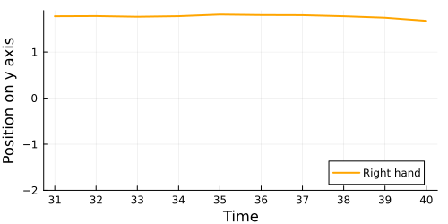

```@meta
CurrentModule = ModalAssociationRules
```

# [Getting started](@id getting-started)

In this introductory section, you will learn about the main building blocks of ModalAssociationRules.jl. 
Also if a good picture about *association rule mining* (ARM, from now onwards) is given during the documentation, to make the most out of this guide we suggest reading the following articles:
- [Association rule mining introduction and Apriori algorithm](http://ictcs2024.di.unito.it/wp-content/uploads/2024/08/ICTCS_2024_paper_16.pdf)
- [FPGrowth algorithm](https://www.cs.sfu.ca/~jpei/publications/sigmod00.pdf)
The above introduce two important algorithms, which are also built-in into this package. Moreover, the latter one is the state-of-the-art in the field of ARM.

Further on in the documentation, the potential of ModalAssociationRules.jl will emerge: this package's raison d'être is to generalize the already existing ARM algorithms to modal logics, which are more expressive than propositional ones (as it allows as to reason in terms of relational data) and computationally less expensive than first-order logic. If you are new to [Sole.jl](https://github.com/aclai-lab/Sole.jl) and you want to learn more about modal logic, please have a look at [SoleLogics.jl](https://github.com/aclai-lab/SoleLogics.jl) for a general overview on the topic, or follow this documentation and return to the link if needed.

## Non-technical introduction

Consider a time series dataset. For example, let us consider the [NATOPS](https://github.com/yalesong/natops) dataset, obtained by recording the movement of different body parts of an operator. We are interested in extracting temporal considerations hidden in the data. To do so, we can highlight specific intervals in each time series (we assume every signal to have the same length). For example, consider the following time series encoding the vertical trajectory of the right hand of an operator.

<!-- Figure code:
plot(X[1][1,5], label="Right hand", linecolor=:orange, linewidth=2, size=(500,250)); xlabel!("Time"); ylabel!("Position on y axis") 
-->


At this point, we can highlight different intervals on the signal. For example, via windowing:

<!-- Figure code:
windows = [(s:s+9) for s in 1:10:41]
for i in windows
    x = collect(i)
    y = @view X[1][1,5][x]

    p = plot(x, y; 
        label="Right hand", linecolor=:orange, linewidth=2, 
        size=(500,250), ylims=(-2,1.9), 
        xticks=collect(1:50), xlabel="Time", ylabel="Position on y axis"
    )
    
    savefig(p, string <| i[1])
end
!-->

<div style="display: flex; justify-content: space-between">
    
    
    
    
    
</div>

Instead of working it through propositional logic, we decide to segment each time series in intervals, and we build relationships between intervals through a specific [modal logic](https://en.wikipedia.org/wiki/Modal_logic).

In particular, we choose [HS Interval Logic](https://dl.acm.org/doi/pdf/10.1145/115234.115351) in order to establish relationships such as "interval X **OVERLAPS** with Y", or "interval Y comes **AFTER** X".

Now that the dataset is ready, we define some **itemset**. An itemset is a conjunction of facts (possibly, one fact, called **item** in the jargon). For example, we define the two following itemsets called $A$ and $B$:

1) $A \coloneqq \text{max}[Δ\text{Y[Hand tip r and thumb r]}] ≤ 0.0$
2) $B \coloneqq [\text{O}]\text{min}[\text{Y[Hand tip r]}] ≥ -0.5$

The first one could be translated as *in the current interval, the right hand is oriented downward*. We could also read it as *the vertical distance between the right-hand middle finger tip and the right-hand thumb tip is negative*.

In the second fact, the relation **OVERLAPS** must be considered universally because of the square brackets. It can be translated into the phrase *in all the intervals overlapping with the current one, the hand is located higher than $-0.5$*.

Now that we have arranged two itemsets, we want to establish if they are interesting based of a frequentist approach. In particular, we want to compute the **support** of each itemset, that is, the relative frequency of how many times the itemset is true within the data. 

By leveraging a mining algorithm, we can join frequent itemsets two by two, iterating until it is not possible to join itemsets anymore.

Let us say that the itemset $\{A,B\}$ turns out to be frequent. At this point, we can generate two rules $A \Rightarrow B$ and $B \Rightarrow A$. Now, we can compute specific meaningfulness measures to determine whether a rule is an association rule or not.


## Core definitions

One [`Item`](@ref) is just a logical formula, which can be interpreted by a certain model. At the moment, here, we don't care about how models are represented by Sole.jl under the hood, or how the checking algorithm works: what matters is that [`Item`](@ref)s are manipulated by ARM algorithms, which try to find which conjunctions between items are most *statistically significant*.

```@docs
Item
Itemset
```

Notice that one [`Itemset`](@ref) could be a set, but actually it is a vector: this is because, often, ARM algorithms need to establish an order between items in itemsets to work efficiently. To convert an [`Itemset`](@ref) in its [conjunctive normla form](https://en.wikipedia.org/wiki/Conjunctive_normal_form) we simply call [`formula`](@ref).
```@docs
formula
```

In general, an [`Itemset`](@ref) behaves exactly like you would expect a `Vector{Item}` would do. At the end of the day, the only difference is that manipulating an [`Itemset`](@ref), for example through `push!` or `union`, guarantees the wrapped items always keep the same sorting.

Enough about [`Itemset`](@ref)s. Our final goal is to produce *association rules*. 

```@docs
ARule
content(rule::ARule)
antecedent(rule::ARule)
consequent(rule::ARule)
```

To print an [`ARule`](@ref) enriched with more informations (at the moment, this is everything we need to know), we can use the following.
```@docs
arule_analysis(arule::ARule, miner::Miner; io::IO=stdout)
```

Sometimes we could be interested in writing a function that consider a generic entity obtained through an association rule mining algorithm (*frequent itemsets* and, of course, *association rules*). Think about a dictionary mapping some extracted pattern to metadata. We call that generic entity "an ARM subject", and the following union type comes in help.
```@docs
ARMSubject
```

## Measures

To establish when an [`ARMSubject`](@ref) is interesting, we need *meaningfulness measures*. 
```@docs
Threshold
MeaningfulnessMeasure

islocalof(::Function, ::Function)
localof(::Function)

isglobalof(::Function, ::Function)
globalof(::Function)
```

The following are little data structures which will return useful later, when you will read about how a dataset is mined, looking for [`ARMSubject`](@ref)s.
```@docs
LmeasMemoKey
LmeasMemo
GmeasMemoKey
GmeasMemo
```

What follows is a list of the already built-in meaningfulness measures.
In the [`Hands on`](@hands-on) section you will learn how to implement your own measure.
More information are available in the [`Modal generalization`](@man-modal-generalization) section.

```@docs
lsupport
gsupport
lconfidence
gconfidence
```

## Mining structures

Finally, we are ready to start mining. To do so, we can create a custom [`AbstractMiner`](@ref) type.

```@docs
AbstractMiner
```

The main implementation of such an interface is embodied by the [`Miner`](@ref) object.
To mine using a Miner, we just need to specify which dataset we are working with, together with a mining function, a vector of initial [`Item`](@ref)s, and the [`MeaningfulnessMeasure`](@ref)s to establish [`ARMSubject`](@ref) interestingness.

```@docs
Miner
```

Let us see which getters and setters are available for [`Miner`](@ref).

```@docs
data(miner::Miner)
algorithm(miner::Miner)
items(miner::Miner)

measures(miner::Miner)
findmeasure(miner::Miner,meas::Function; recognizer::Function=islocalof)
itemsetmeasures(miner::Miner)
arulemeasures(miner::Miner)

getlocalthreshold(miner::Miner, meas::Function)
getglobalthreshold(miner::Miner, meas::Function)
```

After a [`Miner`](@ref) ends mining (we will see how to mine in a second), frequent [`Itemset`](@ref)s and [`ARule`](@ref) are accessible through the getters below.
```@docs
freqitems(miner::Miner)
arules(miner::Miner)
```

To start the mining algorithm, simply call the following:
```@docs
mine!(miner::Miner)
```

The mining call returns an [`ARule`](@ref) generator. Since the extracted rules could be several, it's up to you to collect all the rules in a step or arule_analysis them lazily, collecting them one at a time. You can also call the mining function ignoring it's return value, and then generate the rules later by calling the following.

```@docs
generaterules!(miner::Miner)
```

During both the mining and the rules generation phases, the values returned by [`MeaningfulnessMeasure`](@ref) applied on a certain [`ARMSubject`](@ref) are saved (memoized) inside the [`Miner`](@ref). Thanks to the methods hereafter, a [`Miner`](@ref) can avoid useless recomputations.

```@docs
localmemo(miner::Miner)
localmemo!(miner::Miner, key::LmeasMemoKey, val::Threshold)
globalmemo(miner::Miner)
globalmemo!(miner::Miner, key::GmeasMemoKey, val::Threshold)
```

## Miner customization

A [`Miner`](@ref) also contains two fields to keep additional information, those are [`info`](@ref) and [`miningstate`](@ref).

The [`info`](@ref) field in [`Miner`](@ref) is a dictionary used to store extra information about the miner, such as statistics about mining. Currently, since the package is still being developed, the `info` field only contains a flag indicating whether the `miner` has been used for mining or not.

```@docs
Info
info(miner::Miner)
info!(miner::Miner, key::Symbol, val)
hasinfo(miner::Miner, key::Symbol)
```

When writing your own mining algorithm, or when mining with a particular kind of dataset, you might need to specialize the [`Miner`](@ref), keeping, for example, custom metadata and data structures. To specialize a [`Miner`](@ref), you can fill a [`MiningState`](@ref) structure to fit your needs.

```@docs
MiningState
miningstate(miner::Miner)
miningstate!(miner::Miner, key::Symbol, val)
hasminingstate(miner::Miner, key::Symbol)
initminingstate(::Function, ::AbstractDataset)
```

## Parallelization

To support parallel mining, we provide a [`Bulldozer`](@ref) miner, that is, a lightweight copy of [`Miner`](@ref) which mines a specific section of the data in its own thread.

```@docs
Bulldozer
datalock(bulldozer::Bulldozer)
memolock(bulldozer::Bulldozer)
miningstatelock(bulldozer::Bulldozer)

datatype(::Bulldozer{D}) where {D<:MineableData}
itemtype(::Bulldozer{D,I}) where {D,I<:Item}
instancesrange(bulldozer::Bulldozer)
instanceprojection(bulldozer::Bulldozer, ith_instance::Integer)

data(bulldozer::Bulldozer)

items(bulldozer::Bulldozer)
itemsetmeasures(bulldozer::Bulldozer)


localmemo(bulldozer::Bulldozer)

worldfilter(bulldozer::Bulldozer)

itemset_policies(bulldozer::Bulldozer)

miningstate(bulldozer::Bulldozer)
miningstate!(bulldozer::Bulldozer, key::Symbol, val)

hasminingstate(bulldozer::Bulldozer, key::Symbol)

measures(bulldozer::Bulldozer)

miner_reduce!(local_results::AbstractVector{B}) where {B<:Bulldozer}
load_localmemo!(miner::AbstractMiner, localmemo::LmeasMemo)
```


