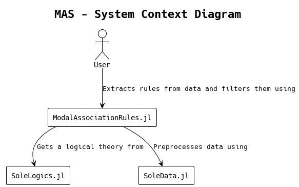
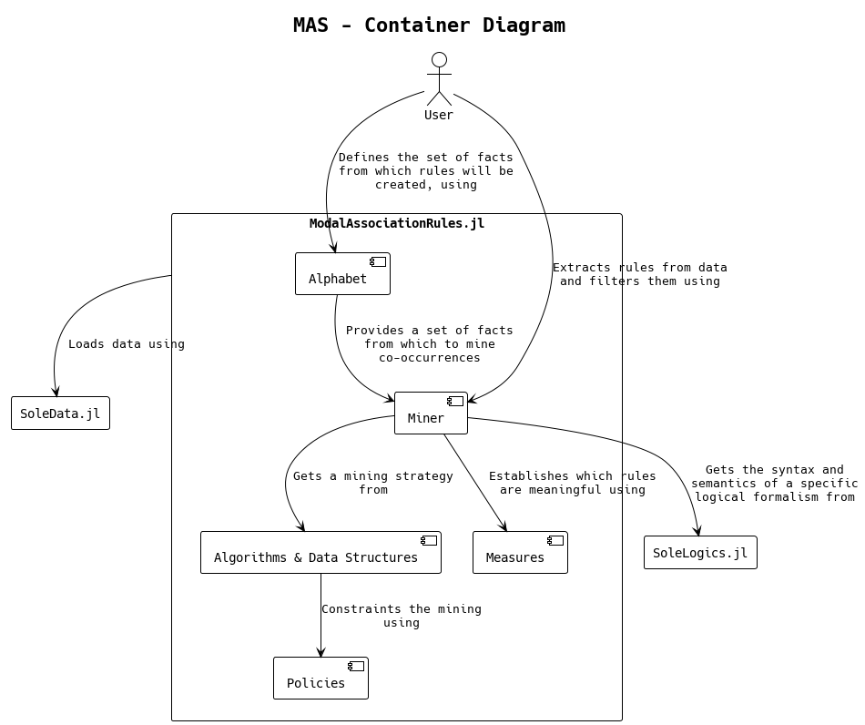

```@meta
CurrentModule = ModalAssociationRules
```

# ModalAssociationRules

## Introduction

Welcome to the documentation for [ModalAssociationRules](https://github.com/aclai-lab/ModalAssociationRules.jl) (or MAS), a Julia package for mining association rules.

## Installation

To install MAS, simply launch:
```julia
using Pkg
Pkg.add("ModalAssociationRules")
```

## [Feature Summary](@id feature-summary)

* Define atomic facts, called *items*, that can be true or false with respect to some instance data; for example, given a collection of signals `I=[[1,2,3], [4,5,6], [7,8,9]]`, an item `p` could encode the fact that `sum(I[2]) < 16`.
* Enhance the expressivity of each item and combine them in sets, called *itemsets*, leveraging more-than-propositional logical formalisms; considering the instance data `I` above, for example, an item `q` could encode the fact that `mean(I[3]) = 8` and `q and after p` encodes the fact that `q` is true for the i-th dimension of the instance and `p` is true at the same time on the (i+1)-th dimension.
* Extract the *association rules* hidden in data; for example, the rule `p => q` encodes the fact that, if `p` is true, then `q` is true too. The extraction process is easily configurable via a [`Miner`](@ref) object, and can be executed with the parallel implementation of state-of-the-art algorithms.
* Analyze and recap the extract rules in a succinct manner.

## Diagrams

What follows are the [system and container context diagrams](https://c4model.com/), delineating the environment of this package and its main components from an high level perspective.



As shown in the schema above, MAS interfaces with two main dependencies. In fact, while the main purpose of this package is to extract constrained co-occurrence relations from data, the representation layer of logical facts and data is almost entirely provided by two packages. [SoleLogics.jl](https://github.com/aclai-lab/SoleLogics.jl) provides both the syntactical and semantical aspects related to various logical formalisms; the `q and after p` example in the [`Feature Summary`](#feature-summary) section is not casual, and refers to [Halpern and Shoham's modal logic for time intervals](https://dl.acm.org/doi/abs/10.1145/115234.115351), which SoleLogics provide. [SoleData.jl](https://github.com/aclai-lab/SoleData.jl) is used to automatically create [Kripke structures](https://en.wikipedia.org/wiki/Kripke_structure_(model_checking)) from the given data, that is, expliciting the latter in the form of relational data.



Each of the components above is explained exhaustively in the *Use cases*(TODO) and *Contributing*(TODO) sections. The first one is a complement to the [Getting started](#man-core) section, while the second one is designed for developers that who are willing to contribute to this package.

## Package potential at a glance

Consider a time series dataset obtained by recording the hand movements of an operator. Instead of working it through propositional logic, we decide to segment each time series in intervals, and we build relationships between intervals through a specific [modal logic](https://en.wikipedia.org/wiki/Modal_logic).

In particular, we choose [HS Interval Logic](https://dl.acm.org/doi/pdf/10.1145/115234.115351) in order to establish relationships such as "interval X **OVERLAPS** with Y", or "interval Y comes **AFTER** X".

Now that the dataset is ready, we define some **itemset**. An itemset is a conjunction of facts (possibly, one fact, called **item** in the jargon). For example, we define the two following itemsets called $A$ and $B$:

1) $A \coloneqq \text{max}[Δ\text{Y[Hand tip r and thumb r]}] ≤ 0.0$
2) $B \coloneqq [\text{O}]\text{min}[\text{Y[Hand tip r]}] ≥ -0.5$

The first one could be translated as *in the current interval, the right hand is oriented downward*. We could also read it as *the vertical distance between the right-hand middle finger tip and the right-hand thumb tip is negative*.

In the second fact, the relation **OVERLAPS** must be considered universally because of the square brackets. It can be translated into the phrase *in all the intervals overlapping with the current one, the hand is located higher than $-0.5$*.

Now that we have arranged two itemsets, we want to establish if they are interesting based of a frequentist approach. In particular, we want to compute the **support** of each itemset, that is, the relative frequency of how many times the itemset is true within the data. 

By leveraging a mining algorithm, we can join frequent itemsets two by two, iterating until it is not possible to join itemsets anymore.

Let us say that the itemset $\{A,B\}$ turns out to be frequent. At this point, we can generate two rules $A \Rightarrow B$ and $B \Rightarrow A$. Now, we can compute specific meaningfulness measures to determine whether a rule is an association rule or not.

## About

The package is developed by the [ACLAI Lab](https://aclai.unife.it/en/) @ University of Ferrara.

*ModalAssociationRules.jl* lives in the context of [*Sole.jl*](https://github.com/aclai-lab/Sole.jl), an open-source framework for *symbolic machine learning*, originally designed for machine learning based on modal logics (see [Eduard I. Stan](https://eduardstan.github.io/)'s PhD thesis *'Foundations of Modal Symbolic Learning'* [here](https://www.repository.unipr.it/bitstream/1889/5219/5/main.pdf)).
