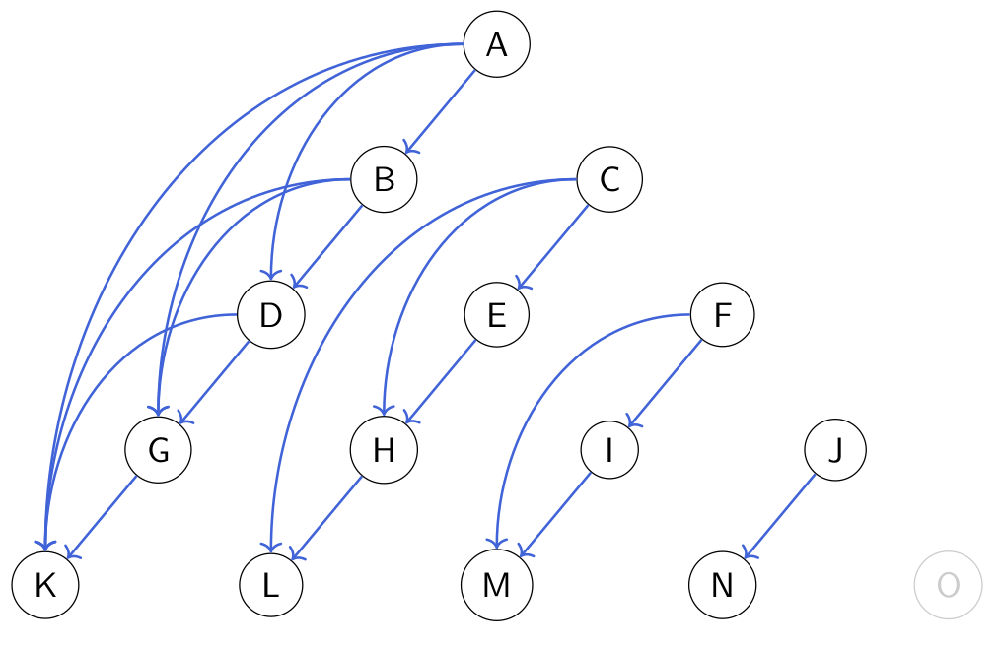
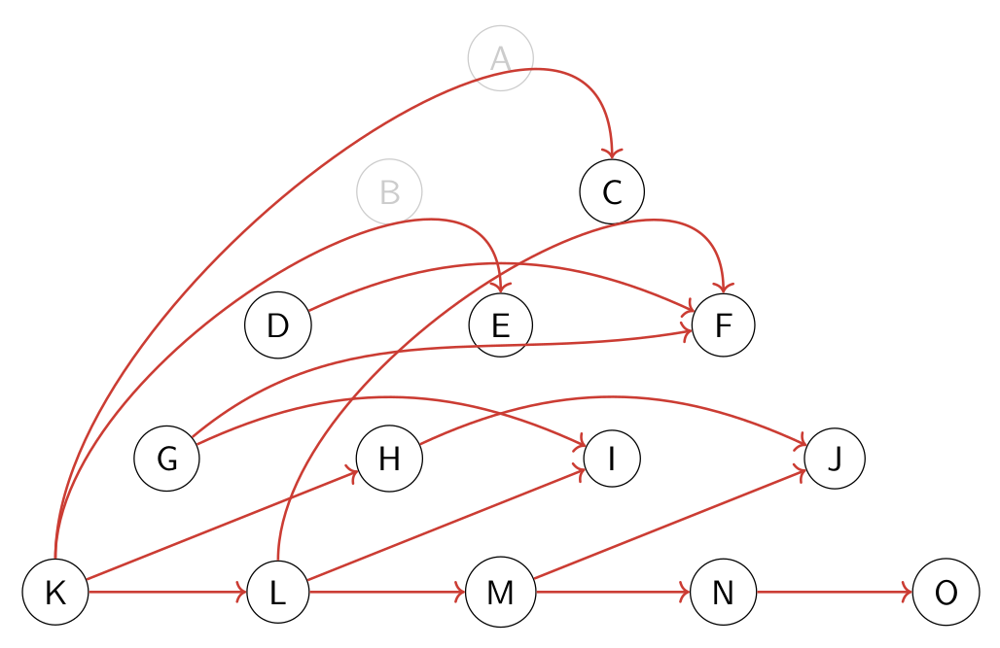

```@meta
CurrentModule = ModalAssociationRules
```

# [Association rule mining with modal logic](@id man-modal-generalization)

Symbolic modal learning is a branch of machine learning which deals with training classical symbolic machine learning models (e.g., list and set of rules, decision trees, random forests, association rules, etc.) but substituting propositional logic with a more expressive logical formalism (yet, computationally more affordable than first order logic), that is, a specific kind of modal logic.

In the context of this package, modal logic helps us highlight complex relations hidden in data, especially in *unstructured data*, consisting of graph-like relational data, time series, spatial databases, text, etc. For more information about the modal symbolic learning, we suggest reading the main page of [`Sole.jl` framework](https://github.com/aclai-lab/Sole.jl) and [`SoleLogics.jl`](https://github.com/aclai-lab/SoleLogics.jl).

The idea is to discretize complex data into relational objects called *Kripke models*, each of which consists of many propositional models called *worlds*, and expliciting the relations between worlds. In this way, it is possible to mine complex [`Itemset`](@ref), including a certain subset of [`Item`](@ref) that are true on a target world, but also *modally enhanced* items that are true on related worlds.

A picture is worth a thousand words. Here you are a slightly more complex example, with respect to the one at the top of [`Getting started`](@ref getting-started) section. We consider this monovariate time series:


We want to encode a graph-like structure from the data above. We could think of various strategies, one of which is to consider every contiguous subsequence in the time series and model it as a set of intervals.


At this point, we can see every resulting blue signal as a propositional model, on which items may be evaluated as true or false. In the modal logic jargon, this is exactly a Kripke model.


After fixing a set of suitable relations, we express them with arcs in the structure. Without defining them, we graphically present some possible relations between intervals. The one below is the *begins* relation.



Conversely, this one is the *ends* relation.


When an interval is completely included in another one, then we say that it happens *during* the other one.


Finally, we say that an interval comes just *after* another one if its end coincides with the beginning of the other one.



Every relation $R$ can be declined in an *existential* or a *universal* way. In the former (latter) case, given an item $p$, we say that $<R>p$ is true on $w$ if at least one world (all worlds) $w'$ is such that $wRw'$ and $p$ is true on $w'$. Such relations can be encoded thanks to SoleLogics.jl; in particular, we use `diamond(relation_name)` to indicate an *existential modality* while `box(relation_name)` to indicate universal ones:

```julia
myitem = ScalarCondition(VariableDistance(1, [1,2,3]), <=, 1.0) |> diamond(IA_L)
```

## Meaningfulness measures 

We already introduced [`lsupport`](@ref), [`gsupport`](@ref), [`lconfidence`](@ref) and [`gconfidence`](@ref) in the [`Getting started`](#man-core) section. Other measures that are already built into the package, are the following; note how they are always organized in both *local* and *global* versions.

Local means that a measure is designed to be applied within a modal instance (a Kripke model), while global keywords denotes the fact that the computation is performed across instances.

```@docs
llift
glift
lconviction
gconviction
lleverage
gleverage
```

In general, we can define new meaningfulness measures by leveraging the following macros, ensuring to avoid solving repeated subproblems when computing the measure.

```@docs
@localmeasure
@globalmeasure
```

You can identify which is the local (global) counterpart of a global (local) meaningfulness measure with the following utility dispatches.

```@docs
islocalof(::Function, ::Function)
localof(::Function)

isglobalof(::Function, ::Function)
globalof(::Function)
```

Of course, you can even link your custom measures.

```@docs
@linkmeas
```

## Mining Algorithms

The core of every association rule mining workflow consists of extracting the frequent patterns from data. To explore the search space of all such patterns, we can use a "level-wise" approach, based on breadth-first search algorithm, called [`apriori`](@ref), or a "vertical data format" approach, based on a depth-first search, called [`eclat`](@ref).

```@docs
apriori
eclat
```

We suggest to run [`fpgrowth`](@ref), as it is the most performant algorithm among those implemented at the moment of writing. It is based on a compression strategy, based on iteratively "projecting" the initial dataset; projections are particular slicings of the initial dataset, keeping only the information needed for continuining the mining process.

```@docs
fpgrowth
FPTree
```

## Mining Policies

It is possible to limit the action of the mining, to force an [`AbstractMiner`](@ref) to only consider a subset of the available data.

```@docs
worldfilter
```

We can also constrain the generation of new itemsets and rules by defining a vector of policies.
Every policy is a closure returning a custom parameterized checker for a certain constraint.

For what regards itemsets, the following dispatches are available:

```@docs
itemset_policies
islimited_length_itemset
isanchored_itemset
isdimensionally_coherent_itemset
```

The following are referred to association rules:

```@docs
arule_policies
islimited_length_arule
isanchored_arule
isheterogeneous_arule
```

To apply the policies, call the following.

```@docs
Base.filter!(targets::Vector{Union{ARule,Itemset}}, policies_pool::Vector{Function})
```

## Anchored semantics

To ensure the mining process is *fair* when dealing with modal operators, we must ensure that the miner is compliant with *anchored semantics constraints*.

To understand why the fairness of the frequent pattern extraction process is not guaranteed in the modal scenario, we suggest reading [this short paper](assets/articles/time2025.pdf).

```@docs
isanchored_miner
anchored_apriori
anchored_fpgrowth
anchored_eclat
```

Each algorithm above is simply a small wrapper around [`anchored_semantics`](@ref):

```@docs
anchored_semantics
```

## Utilities

The following utilities often involve performing some combinatoric trick between [`Itemset`](@ref)s and [`ARule`](@ref)s, and might be useful to avoid reinventing the wheel.

```@docs
combine_items
grow_prune
anchored_grow_prune
```

These are three common types definition appearing during modal association rule mining.

```@docs
WorldMask
EnhancedItemset
ConditionalPatternBase
```

We can enrich the [`MiningState`](@ref) of an [`AbstractMiner`](@ref) by using the following trait, depending on the specific algorithm and the kind of data we want to handle.

```@docs
initminingstate(::typeof(fpgrowth), ::MineableData)
```