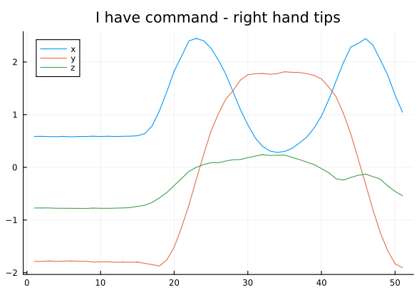
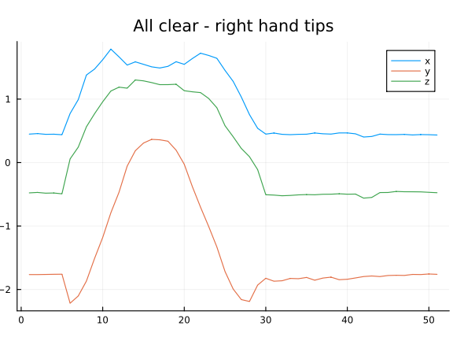
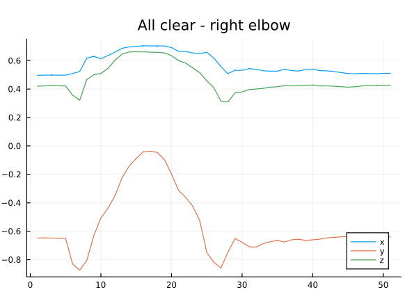
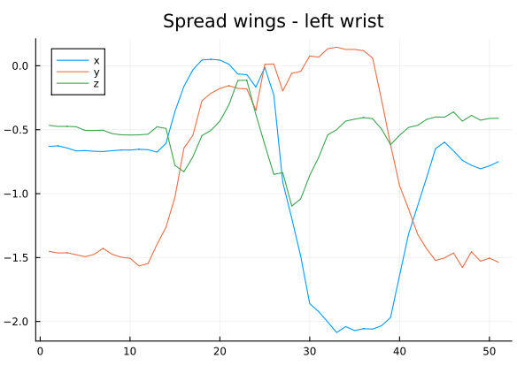
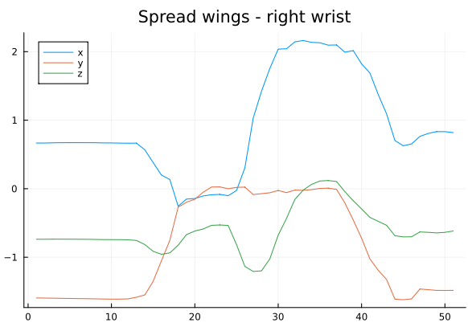

# ModalAssociationRules.jl experiments

This file is intended to give a general overview of the most remarkable results obtained by extracting association rules from some dataset.
Currently, only [NATOPS](https://github.com/yalesong/natops) dataset is being analysed.

The following results are a small part of all the extracted rules, and are made by manually picking the literals from which itemsets are extracted.
To know more about experiments setup, see `<dataset-name>-experiments.jl`.

## NATOPS

### I have command
Support thresholds: $0.1$ 
Confidence thresholds: $0.5$

- When the operator's right hand is at the height of his shoulders, then it's palm is rotated in front of him.

    `(max[Z[Hand tip r]] ≥ 0) => (min[Y[Hand tip r]] ≥ -0.5)`   gconfidence: 0.95

- When the operator's right hand is away from his body, and is also rotated, then this means that it is not low.

    `(min[X[Hand tip r]] ≥ 1) ∧ (min[Y[Hand tip r]] ≥ -0.5) => (max[Z[Hand tip r]] ≥ 0)`   gconfidence: $1.0$

- When operator's right hand terminated the movement ascending phase (it is "close to its body" in the X axis, but also further away from the ground), then it is rotated.

    `(min[X[Hand tip r]] ≤ 1) ∧ (min[Z[Hand tip r]] ≥ 0) => (min[Y[Hand tip r]] ≥ -0.5)`   global confidence: $0.92$

### All clear
Support thresholds: $0.1$ 
Confidence thresholds: $0.5$

- When the elbow is frontally moved away from the operator's body during its [of the elbow] ascent phase, the arm is outstretched (that is, the hand is frontally moved away, proportionally to the initial elbow X positive acceleration).

    `(min[X[Elbow r]] ≥ 0.6) ∧ ([D]min[Z[Elbow r]] ≥ -0.5) => (min[X[Hand tip r]] ≥ 1)`   global confidence: $1.0$

- discuss with the others

    `(min[X[Elbow r]] ≥ 0.6) ∧ (min[Z[Elbow r]] ≥ -0.5) ∧ ([D]min[X[Hand tip r]] ≥ 1) ∧ ([D]min[Y[Hand tip r]] ≥ 0.5) ∧ ([D]min[X[Elbow r]] ≥ 0.6) => ([D]min[Z[Elbow r]] ≥ -0.5)`   global confidence: $1.0$

- discuss with the others

    `(min[Z[Elbow r]] ≥ -0.5) ∧ ([D]min[Y[Hand tip r]] ≥ 0.5) => (min[X[Elbow r]] ≥ 0.6)`   global confidence: $0.8$

### Spread wings

- While left-wrist blue line is low in the first plot, the right-wrist blue line is high in the second one. 

    `(max[X[Wrist l]] ≤ -1.0) => ([D]min[X[Wrist r]] ≥ 1)`   global confidence $1.0$

- discuss with the others

    `(⟨D⟩max[X[Wrist l]] ≤ -1.0) ∧ (⟨D⟩min[Y[Wrist l]] ≥ -0.5) ∧ (⟨E⟩max[X[Wrist l]] ≤ -1.0) ∧ (⟨E⟩min[Y[Wrist l]] ≥ -0.5) ∧ (⟨O⟩max[X[Wrist l]] ≤ -1.0) => (min[Y[Wrist l]] ≥ -0.5)`   global confidence $0.7666$